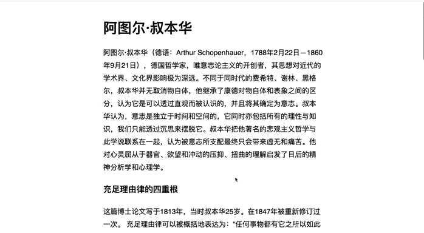

# CSS 中的滑动 (滚动) 时间动画

以前，我们如果要通过 `CSS` 动画来来为页面添加横向滚动时间轴动画，可能更倾向使用 `Javascript` 来实现，现在我们也可以通过 `CSS` 的新特性 `animation-timeline` 属性来实现该效果了，话不多说，我们来实现一个横向滚动的时间轴动画。

> 相关标准可以参考2023年6月6日 [W3C 的标准草案](https://www.w3.org/TR/scroll-animations-1/#scroll-timelines)


## 实现一个横向滚动时间轴动画
需求很简单，当用户滚动页面时，在页面上方展示一个从左向右的进度条，实时展示当前页面的阅读进度。如下：



> 具体 DEMO 可以查看这个页面 [animation-timeline-scroll](https://docs.qjidea.com/demos/scroll/basic.html)

- 首先我们定义一个从左到右的动画

```css
@keyframes scaleFrame {
  0% {
    transform: scaleX(0);
  }
  100% {
    transform: scaleX(1);
  }
}
```
- 接下来，将进度条和滚动进度即当前阅读进度通过 `animation-timeline` 属性关联起来
```css
.progress {
  animation-timeline: scroll();
}
```

`scroll()` 表示匿名滚动，`scroll()` 可以接收两个参数：滚动容器和滚动轴。具体可以参考 [scroll() 函数](https://developer.mozilla.org/en-US/docs/Web/CSS/animation-timeline/scroll)


- 最后，把动画添加到进度条元素中
```css
.progress {
  animation: scaleProgress auto linear;
  animation-timeline: scroll(root);
}
```

## 复合动画
类似上面的例子，还可以添加更多的动画效果到进度条，比如颜色的线性渐变，随着进度条改变，进度条颜色也随之改变。示例如下：


> 具体 DEMO 可以查看这个页面 [animation-timeline-scroll-multiple](https://docs.qjidea.com/demos/scroll/multiple.html)

在复合动画中，多添加了 `colorSteps` 动效，实现了颜色渐变。
```css
.progress {
    ......
    animation: scaleProgress auto linear, colorSteps auto linear;
    animation-timeline: scroll(root);
}


@keyframes colorSteps {
    0% {
        background-color: blue;
    }
    50% {
        background-color: green;
    }
    100% {
        background-color: red;
    }
}
```
## 改变动画函数
我们知道，`animation` 可以接收不同的时间函数，即[animation-timing-function](https://developer.mozilla.org/en-US/docs/Web/CSS/animation-timing-function)，接下来，我们将改变之前的线性函数 `linear`，分别使用 `steps()` 和 `cubic-bezier()` 函数来实习不同的动效。

### 分步展示 steps() 
我们看到文本分为了五个主要段落，如果想把进度条也分为五个不同的颜色段，那就可以使用 `steps()` 函数来实现。主要效果如下：


> 具体 DEMO 可以查看这个页面 [animation-timeline-scroll-steps](https://docs.qjidea.com/demos/scroll/steps.html)


在该动效中，使用`steps()` 函数把进度条分为5段，分别展示不同颜色，但是如何才能让这5段颜色按照进度条去动态展示呢？在这里我们需要使用裁剪动效即 [clip-path](https://developer.mozilla.org/zh-CN/docs/Web/CSS/clip-path) 来实现。`clip-path`的效果和日常使用的照片裁剪功能有点类似，**我们可以使用`clip-path`对任意区域进行任意形状的裁剪**。举例来说，现在有一个图像区域，需要再其中裁剪出一个圆形、矩形、平行四边形或者任意多边形，均可使用`clip-path`进行处理。

```css
.progress {
    ......
    background: linear-gradient(
        to right,
        red 20%,
        orange 0,
        orange 40%,
        yellow 0,
        yellow 60%,
        lime 0,
        lime 80%,
        green 0
    );
    /* steps()分步动画,cubic-bezier() 同理，只是进度处理不同 */
    animation: clip auto steps(5) forwards;
    animation-timeline: scroll(root);
}

/* 分步裁剪动画，0 表示隐藏图像，100表示全部展示 */
@keyframes clip {
    0% {
        clip-path: polygon(0 0, 0 0, 0 100%, 0 100%);
    }
    100% {
        clip-path: polygon(0 0, 100% 0, 100% 100%, 0 100%);
    }
}
```
接下来以处理平行四边为例简要说明`clip-path`如何使用

- 首先我们创建一个 `300*300` 的图像区域 `area`，设置边框，让该区域显现，作为坐标参照系
```html
<div class="area" />
```
```css
.area {
    height: 300px;
    width: 300px;
    border: 1px solid red;
}
```
- 接下来在该区域中设置一个用来展示平行四边形的区域 `parallelogram`
```html
<div class="area">
    <div class="parallelogram"></div>
</div>
```
```css
.parallelogram {
  height: 300px;
  width: 300px;
  background-color: blue;
  clip-path: polygon(20% 0%, 80% 0%, 70% 100%, 10% 100%);
}
```
效果如下 


使用 `clip-path` 裁剪的核心是图像坐标的选取，可理解如下：


> 更多 `clip-path` 动效可参考  [animating-with-clip-path](https://css-tricks.com/animating-with-clip-path/)、[animations-using-clip-path](https://blog.logrocket.com/guide-to-css-animations-using-clip-path/)


## 新的交互
### 水平方向文本阅读


### 水平方向滚动图像


### 组合动画


## 总结
本文我们首先从**实现一个横向滚动时间轴动画**开始，引入了`animation-timeline: scroll()`新特性；接着我们介绍了如何添加复合组合；然后改变动画函数，介绍了 `steps()` 函数和 `clip-path` 如何使用；最后我们看到基于新的动画特性，我们可以实现一些有趣的前端交互。本文主要参考了 [scroll-progress-animations-in-css](https://developer.mozilla.org/en-US/blog/scroll-progress-animations-in-css/)，有兴趣的朋友可以进一步阅读。


  


