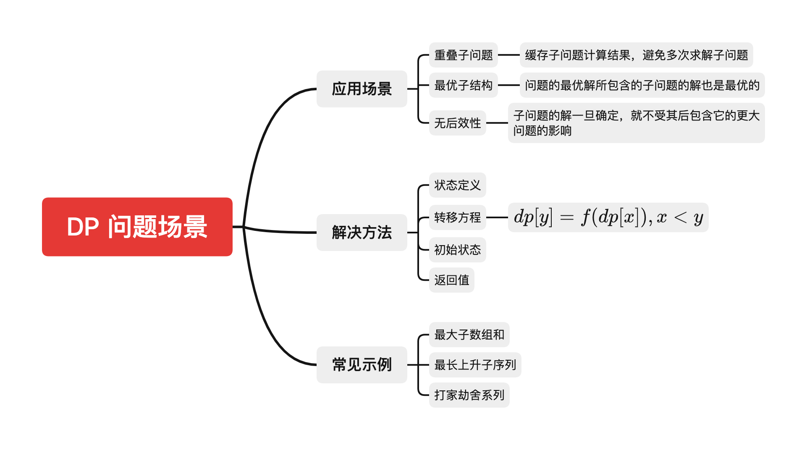

# 动态规划

## 简介
动态规划（Dynamic programming，简称 DP）是美国数学家 [Richard Bellman](https://zh.wikipedia.org/wiki/%E7%90%86%E6%9F%A5%E5%BE%B7%C2%B7%E8%B2%9D%E7%88%BE%E6%9B%BC)在研究**决策过程和控制系统理**时创建的新方法。它在数学上属于运筹学的一个分支，在数学、管理科学、计算机科学、经济学和生物信息学中均有应用，核心是**通过把原问题分解为相对简单的子问题的方式**来求解复杂问题，主要应用是求解决策过程最优的数学方法。

简单来讲，动态规划是一种算法思想，其核心是把问题分解为子问题，通过求解子问题进而解决当前问题。实际中，并非所有问题都可以通过动态规划来求解，通过动态规划解决对问题，对问题和其分解对子问题都有一定场景要求的，动态规划适用于有**重叠子问题**和**最优子结构**性质的问题，这类问题使用动态规划所耗时间往往比朴素解法更少。

如下图，我们对动态规划问题从**应用场景**、**解决方法**和**常见示例题目**三个方面来展开。



> [动态规划 Wiki](https://zh.wikipedia.org/wiki/%E5%8A%A8%E6%80%81%E8%A7%84%E5%88%92)

## 题解思路
动态规划问题的数学表达式可以简单的抽象为如下

行内公式：

一般常见解题思路，主要包含以下四步，其中最核心的是确定**转移方程**
- 状态定义
- 转移方程
- 初始值
- 返回值

## 常见题目
动态规划常见的几种类型题目，⭐代表题目难度

### 最大子序和
> :point_right: 
[Wiki 链接](https://leetcode-cn.com/problems/maximum-subarray/)

给你一个整数数组 nums ，请你找出一个具有最大和的连续子数组（子数组最少包含一个元素），返回其最大和。

子数组 是数组中的一个连续部分。

::: tip 
- 示例 1:
  - 输入: nums = [-2,1,-3,4,-1,2,1,-5,4]
  - 输出: 6
  - 解释: 连续子数组 [4,-1,2,1] 的和最大，为 6 。
    
- 示例 2:
  - 输入: nums = [1]
  - 输出: 1
:::

```ts
function maxSubArray(nums: number[]): number {
    let max = nums[0], dp = [nums[0]], len = nums.length

    for (let i = 1; i < len; i++) {
        dp[i] = Math.max(0, dp[i - 1]) + nums[i]
        max = Math.max(max, dp[i])
    }

    return max
};
```

### 股票的最大利润 ⭐
假设把某股票的价格按照时间先后顺序存储在数组中，请问买卖该股票一次可能获得的最大利润是多少？

::: tip 
- 示例 1:
  - 输入: [7,1,5,3,6,4]
  - 输出: 5
  - 解释: 在第 2 天（股票价格 = 1）的时候买入，在第 5 天（股票价格 = 6）的时候卖出，最大利润 = 6-1 = 5 。
    注意利润不能是 7-1 = 6, 因为卖出价格需要大于买入价格。
    
- 示例 2:
  - 输入: [7,6,4,3,1]
  - 输出: 0
  - 解释: 在这种情况下, 没有交易完成, 所以最大利润为 0。

:::

#### 暴力法
```js 
function maxProfit(prices: number[]): number {
        let maxprofit = 0;
        for (let i = 0; i < prices.length - 1; i++) {
            for (let j = i + 1; j < prices.length; j++) {
                let profit = prices[j] - prices[i];
                if (profit > maxprofit) {
                    maxprofit = profit;
                }
            }
        }
        return maxprofit;
    }
}
```

#### DP 

```ts
function maxProfit(prices: number[]): number {
    let min = prices[0], max = 0

    for (let i = 0; i < prices.length; i++) {
        min = Math.min(min, prices[i])
        max = Math.max(max, prices[i] - min)
    }

    return max
};
```

### 最长上升子序列 ⭐⭐
> :point_right: 
[题目链接](https://leetcode-cn.com/problems/longest-increasing-subsequence/)

给你一个整数数组 nums ，找到其中最长严格递增子序列的长度。

子序列是由数组派生而来的序列，删除（或不删除）数组中的元素而不改变其余元素的顺序。例如，[3,6,2,7] 是数组 [0,3,1,6,2,2,7] 的子序列。

::: tip 示例

- 输入：nums = [10,9,2,5,3,7,101,18]
- 输出：4
- 解释：最长递增子序列是 [2,3,7,101]，因此长度为 4
:::

转移公式 `dp[i] = max(dp[i], dp[j] + 1), j<i`

```ts
function lengthOfLIS(nums: number[]): number {
    let len = nums.length, dp = new Array(len).fill(1), max = 0

    if (len === 0) return 0
    
    for (let i = 0; i < len; i++){
        for (let j = 0; j < i; j++){
            if (nums[i] > nums[j]) {
                dp[i] = Math.max(dp[i], dp[j] + 1)
            }
        }

        max = Math.max(max, dp[i])
    }

    return max
};
```


### 最长递增子序列的个数 ⭐⭐⭐
> :point_right: 
[题目链接](https://leetcode-cn.com/problems/number-of-longest-increasing-subsequence/)

给定一个未排序的整数数组，找到最长递增子序列的个数。

::: tip 示例

- 输入：[1,3,5,4,7]
- 输出：2
- 解释：有两个最长递增子序列，分别是 [1, 3, 4, 7] 和[1, 3, 5, 7]。
:::

转移公式：`dp[i] = max(dp[i], dp[j] + 1), 0≤j<i && num[j]<num[i]`

```ts
function findNumberOfLIS(nums: number[]): number {
    let len = nums.length, max = 0, res = 0, dp = new Array(len).fill(1), count = new Array(len).fill(1)

    for (let i = 0; i < len; i++){
        for (let j = 0; j < i; j++){
            if (nums[i] > nums[j]) {
                if (dp[i] < dp[j] + 1) {
                    dp[i] = dp[j] + 1
                    count[i] = count[j]
                } else if (dp[i] === dp[j] + 1) {
                    count[i] += count[j]
                }
            }
        }

        if (dp[i] > max) {
            max = dp[i]
            res = count[i]
        } else if(max === dp[i]) {
            res += count[i]
        }
    }

    return res
};
```
## 总结

## 链接