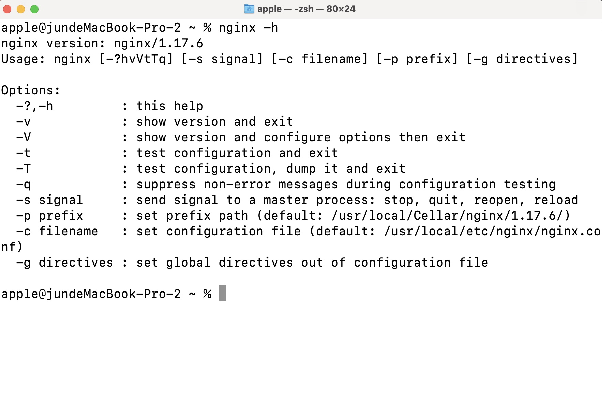

# nginx
## Nginx 是什么
`Nginx`（即 `[engine x]`)，它是一个基于异步框架的网页服务器，同时，它也可以用作反向代理服务器、负载均衡服务器、邮件代理服务器和通用 `TCP/UDP` 代理服务器，最初由俄罗斯程序员 [Igor Sysoev](http://sysoev.ru/en/)编写实现。它在 [Yandex](http://www.yandex.ru/)、 [Mail.Ru](https://mail.ru/)、

根据权威机构 [Netcraft](https://www.netcraft.com/) 2022年8月26日发布的[最新调查数据](https://news.netcraft.com/archives/2022/08/26/august-2022-web-server-survey.html)显示，`Nginx` 服务和代理已经超越 `Apache`，在主流网站中市场份额中占有率最高。可参考下图：


## 为什么使用 Nginx
`Nginx` 最核心的是高性能，它可以让 `Web` 服务器在高并发压力下正常提高服务。基于事件驱动型设计、全异步的网络 `I/O` 处理机制、极少的进程间切换以及许多优化设计，使得 `Nginx` 天生善于处理高并发压力下的互联网请求，同时`Nginx`降低了资源消耗，可以把服务器硬件资源发挥到极致。`Nginx` 的主要特性可概括如下：


## 如何使用
### Nginx 安装
首先是 `Nginx` 的安装，可以从 [`Nginx`官网](https://nginx.org/en/download.html)下载安装，具体安装步骤这里就不展开讲了（如果需要自己开发或者自定义 `Nginx` 相关模块，可以选择从源码构建，需要安装`GCC`、`PCRE`、`zlib`、`OpenSSL`等相关库，这里先作为了解，不展开）

### Nginx 配置文件
首先打开 `nginx.conf`，通过命令行 ` vi /usr/local/etc/nginx/nginx.conf` 查看配置项：

```shell
#user  nobody;
worker_processes  1;

#error_log  logs/error.log;
#error_log  logs/error.log  notice;
#error_log  logs/error.log  info;

#pid        logs/nginx.pid;


events {
    worker_connections  1024;
}


http {
    include       mime.types;
    default_type  application/octet-stream;

    #log_format  main  '$remote_addr - $remote_user [$time_local] "$request" '
    #                  '$status $body_bytes_sent "$http_referer" '
    #                  '"$http_user_agent" "$http_x_forwarded_for"';

    #access_log  logs/access.log  main;

    sendfile        on;
    #tcp_nopush     on;

    #keepalive_timeout  0;
    keepalive_timeout  65;

    #gzip  on;

    server {
        listen       8080;
        server_name  localhost;

        #charset koi8-r;

        #access_log  logs/host.access.log  main;

        location / {
            root   html;
            index  index.html index.htm;
        }

        #error_page  404              /404.html;

        # redirect server error pages to the static page /50x.html
        #
        error_page   500 502 503 504  /50x.html;
        location = /50x.html {
            root   html;
        }

        # proxy the PHP scripts to Apache listening on 127.0.0.1:80
        #
        #location ~ \.php$ {
        #    proxy_pass   http://127.0.0.1;
        #}

        # pass the PHP scripts to FastCGI server listening on 127.0.0.1:9000
        #
        #location ~ \.php$ {
        #    root           html;
        #    fastcgi_pass   127.0.0.1:9000;
        #    fastcgi_index  index.php;
        #    fastcgi_param  SCRIPT_FILENAME  /scripts$fastcgi_script_name;
        #    include        fastcgi_params;
        #}

        # deny access to .htaccess files, if Apache's document root
        # concurs with nginx's one
        #
        #location ~ /\.ht {
        #    deny  all;
        #}
    }


    # another virtual host using mix of IP-, name-, and port-based configuration
    #
    #server {
    #    listen       8000;
    #    listen       somename:8080;
    #    server_name  somename  alias  another.alias;

    #    location / {
    #        root   html;
    #        index  index.html index.htm;
    #    }
    #}


    # HTTPS server
    #
    #server {
    #    listen       443 ssl;
    #    server_name  localhost;

    #    ssl_certificate      cert.pem;
    #    ssl_certificate_key  cert.key;

    #    ssl_session_cache    shared:SSL:1m;
    #    ssl_session_timeout  5m;

    #    ssl_ciphers  HIGH:!aNULL:!MD5;
    #    ssl_prefer_server_ciphers  on;

    #    location / {
    #        root   html;
    #        index  index.html index.htm;
    #    }
    #}
    include servers/*;
}
```
### 常见命令
我们可以通过命令行 `nginx -h`，查看 `Nginx` 常见命令，如下



对于 `Nginx` 来讲，日常一般应用使用最高频的配置文件就是 `nginx.conf` 了，这里我们以更改该配置文件为例，了解下会涉及到哪些命令行操作。

我们先将 `nginx.conf` 中监听的服务端口号改为 `8082`，目的是将 `Nginx` 的服务将由默认的 `http://localhost:80/` 转移到 `http://localhost:8082/`，配置更改如下

```shell
server {
    listen 8082;
}
```
由于 `Nginx` 对配置文件有严格的缩紧语法要求，所以当我们更改了配置文件后，可以通过命令行：

`nginx -t` 

进行配置文件内容检测，可以看到如下信息，表面更改生效：

```text
nginx: the configuration file /usr/local/etc/nginx/nginx.conf syntax is ok
nginx: configuration file /usr/local/etc/nginx/nginx.conf test is successful
```
接着，我们需要重新加载 `Nginx` 配置，使刚才的更改生效，如下

```shell
nginx -s reload
```
生效后，我们访问 `http://localhost:8082/` 页面，可以看到配置已经生效


如果我们要强制停止运行该服务，可使用
```shell
nginx -s stop
```
`-s` 参数其实是告诉 `Nginx` 程序向正在运行的 `Nginx` 服务发送信号量，`Nginx` 程序通过 `nginx.pid` 文件中得到 `master` 进程的进程 `ID`，再向运行中的 `master` 进程发送 `TERM` 信号来快速地关闭该服务。

我们也可以通过 `kill` 命令直接向 `nginx master` 进程发送 `TERM` 或者 `INT` 信号，如下
```shell
# 先查看当前运行进程
ps -ef | grep nginx

501 59054     1   0 10:21上午 ??         0:00.01 nginx: master process nginx -q 
501 60079 59054   0 10:54上午 ??         0:00.01 nginx: worker process 

# 直接 kill
kill -s SIGINT 59054 
or 
kill -s SIGTERM 59054
```

如果希望 `Nginx` 服务可以正常地处理完当前所有请求再停止服务，可以使用
```shell
nginx -s quit
```

## 常见配置
### 静态资源文件
`Nginx` 作为网页服务器，可以指定静态资源文件，配置如下：
```shell
location / {
    #指定静态资源文件到桌面的 index.html
    root   /Users/apple/Desktop/;
    index  index.html index.htm;
}
```
`reload` 加载配置，查看页面，可以看到页面已经从默认页转到了我们指定的页面

### gzip

#### 图像转换格式

#### 基于 客户端 IP 地址 密码（HTTP 基本认证）和 子请求结果的访问控制

#### 响应速度限制

#### 限制 来自一个地址 的同时连接 或 请求的数量

#### 基于 IP 的地理定位

#### njs 脚本语言
#### 反向代理

#### 负载均衡
## 原理相关

