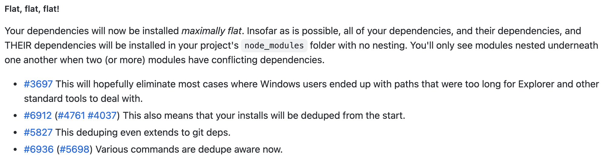
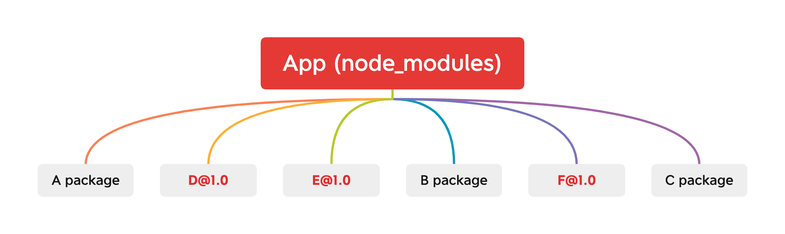
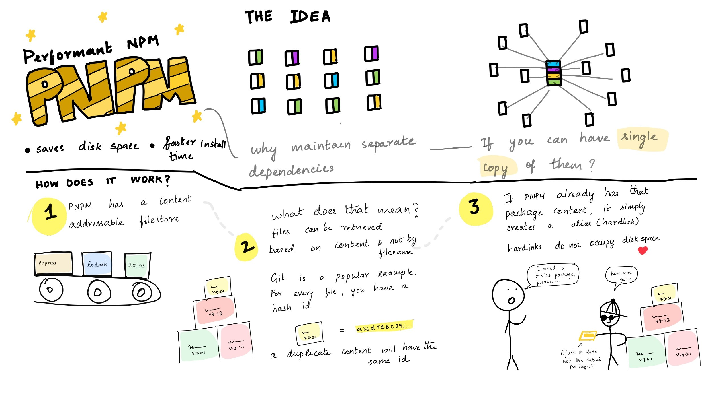

# pnpm


## 背景
如果你从从事过前端方面的工作和开发，相信你对 `npm` 和 `yarn` 这样的工具并不陌生。作为包管理工具，`npm` 已经有了长足的[历史](https://github.com/npm/cli/blob/latest/changelogs/CHANGELOG-1.md)。一个项目初始化过程都需要通过 `npm install` 命令安装相关相关的依赖到 `node_modules` 目录下,对于较大型的前端项目，`node_modules` 的大小很多时候是超乎我们想象的。而 `npm` 在版本更新迭代的过程中，也一直在优化这个问题，从 `npm3` 开始，通过平铺 `node_modules` 依赖，一定程度上缓解了重复包的复用问题。

## npm 发展

### npm2 

在 `npm2` 发展阶段，安装依赖是相对比较直接的，它会直接按照配置文件 `package.json` 中的依赖项去下载相关依赖包，而依赖包的组织形式则是按照树形结构去排列的。由于不同的包的依赖关系在版本上差异较大，依赖关系相对复杂，所以 `npm2` 直接按照配置去下载并组织依赖的方式，是简单明晰的做法，保证了各个依赖的独立性，在依赖变更时，相互并不影响，其关系可以通过下图来描述：


从上图中，我们可以看到
1. `A`、`B`、`C` 包相互独立
2. `A`、`B`、`C` 包可能会依赖相同的包，比如 **`D@1.0`**
3. `A`、`B`、`C` 包可能会存在较深的依赖层级，比如 **`C package`**

其中 `2` 和 `3` 的负面影响会随着项目复杂度上升，可能会导致的几个问题
- 较大的冗余。多次下载的相同的依赖包 **`D@1.0`**，无法实现共享
- 较深层级的依赖树。
  - `node_modules` 依赖包路径过长，超出操作系统最长路径限制（ `windows`：`260` 字符，`macos`：`1024` 字符），参见：
    - [Too many dependencies break the Windows file system](https://github.com/npm/npm/issues/3697) 
    - [Maximum Path Length Limitation](https://docs.microsoft.com/en-us/windows/win32/fileio/maximum-file-path-limitation?tabs=cmd)
    - [Why does the 260 character path length limit exist in Windows?](https://stackoverflow.com/questions/1880321/why-does-the-260-character-path-length-limit-exist-in-windows)
  - 太深的层级导致文件查找复杂度上升，严重影响性能，增加耗时 

> Note: 通过 `npm ls --depth=n` 查看项目相关依赖层级

### npm3
为解决 `npm2` 中存在的冗余和依赖树问题，`npm3` 对依赖项进行了[依赖扁平化讨论和处理](https://github.com/npm/cli/blob/latest/changelogs/CHANGELOG-3.md)



扁平化具体来讲就是依赖不在按照树型进行安装，而是安装将依赖安装在同级目录下，`npm install` 安装依赖时，会按照配置文件 `package.json` 里的依赖顺序进行解析，遇到新包就把它放在第一层级的目录，后面如果遇到第一级目录已有的包，会先进行依赖版本判断，如果版本一样则忽略，否则会按照 `npm2` 的方式依次挂在依赖包目录下,这样处理的原理遵循了[`Nodejs`的依赖解析规则](https://nodejs.org/api/modules.html#all-together)：**当前目录下没有找到`node_modules`，它将递归解析父目录下的`node_modules`**。

使用 `npm3` 安装依赖后如下图：



这种扁平化处理方式一定程度上缓解了冗余和依赖树问题，同时 `npm3` 还支持动态安装更新包，如果依赖有更新，可以通过 `npm dedupe` 命令对依赖树进行优化。

但是 `npm3` 也存在部分问题，比如：

- [phantom_deps(幻影依赖)](https://rushjs.io/pages/advanced/phantom_deps/)。**`npm3`不会以确定的方式安装依赖项**。举例来说：我们在 `NodeJS` 中 `require()` 的函数，不需要考虑配置文件 `package.json`。这可能会导致依赖版本不兼容，并且开发者不容易发现；另外，由于[`Nodejs`的依赖解析规则](https://nodejs.org/api/modules.html#all-together)，这还会导致幻影 `node_modules` ，即依赖向上查找，可能会越过代码目录自身的 `node_modules` 。如下：

```json
- my-monorepo/
  - package.json
  - node_modules/
    - semver/
    - ...
  - my-monorepo/my-library/
    - package.json
    - lib/
      - index.js
    - node_modules/
      - brace-expansion
      - minimatch
      - ...
```
`my-monorepo/my-library/lib/index.js` 可能使用的是`my-monorepo/node_modules` 中的依赖，而非自身目录 `my-monorepo/my-library/node_modules`

- [npm doppelgangers(npm 分身)](https://rushjs.io/pages/advanced/npm_doppelgangers/)。简单来讲，npm 分身是指同一个依赖的不同版本会出现在 `node_modules` 中，比如项目中同时依赖了 `A@1.0.0` 和 `A@2.0.0`，无论是扁平化处理`A@1.0.0` 或 `A@2.0.0`，另一个依赖还是会被重复，如果这样的分身较多，就会导致一些潜在问题，比如扩展包大小变大、相关类型校验交叉等

### npm5
npm5 通过添加 `lock` 文件来记录依赖树信息，进行依赖锁定,从而唯一确定 `node_modules` 的结构,这样处理可以保证团队成员使用同一份`node_modules`依赖结构。但是，我们前文提到的平铺式的算法的复杂性、幻影依赖和分身问题仍然没有解决。

## pnpm 简介
前文我们大致梳理了 `npm` 的发展和遗留问题。而 `pnpm` 比较巧妙地解决了它们，并且极大地提升了依赖包管理的效率。

`pnpm` 指 `performant npm`（高性能的 npm），如 [pnpm 官网](https://pnpm.io/)所言，它是**快速的，节省磁盘空间的包管理工具**，同时，它也较好地支持了 `workspace` 和 `monorepos`。



举例来说，如果项目中，你使用了某个依赖项的多个版本，那么 `pnpm` 只会将有差异的文件添加到仓库。如果某个依赖包有 100 个文件，而它的新版本只改变了其中 1 个文件。那么 `pnpm update` 时只会添加 1 个新文件，而不会复制整个新版本的所有包。此外。所有文件都会存储在硬盘上的某一位置。 当软件包被被安装时，其中的文件会硬链接到这一位置，而不会占用额外的磁盘空间。同时，项目中允许共享同一版本的依赖。接下来我们先了解下 `pnpm` 的使用效果

## pnpm 效果
> 与 npm、yarn、yarn pnp 工具链效果对比，来自 [pnpm benchmarks](https://pnpm.io/zh/benchmarks)

<table><thead>
<tr><th>action</th><th>cache</th><th>lockfile</th><th>node_modules</th><th>npm</th><th>pnpm</th><th>Yarn</th><th>Yarn PnP</th></tr></thead><tbody><tr><td>install</td><td></td><td></td><td></td><td>1m 9.5s</td><td>15.3s</td><td>16.6s</td><td>23.6s</td></tr><tr><td>install</td><td>✔</td><td>✔</td><td>✔</td><td>2.4s</td><td>1.3s</td><td>2.3s</td><td>n/a</td></tr><tr><td>install</td><td>✔</td><td>✔</td><td></td><td>14.8s</td><td>4s</td><td>6.8s</td><td>1.5s</td></tr><tr><td>install</td><td>✔</td><td></td><td></td><td>21.8s</td><td>8.9s</td><td>11.2s</td><td>6.2s</td></tr><tr><td>install</td><td></td><td>✔</td><td></td><td>35.4s</td><td>13.4s</td><td>12s</td><td>17.9s</td></tr><tr><td>install</td><td>✔</td><td></td><td>✔</td><td>3.1s</td><td>1.9s</td><td>7s</td><td>n/a</td></tr><tr><td>install</td><td></td><td>✔</td><td>✔</td><td>2.4s</td><td>1.3s</td><td>7.6s</td><td>n/a</td></tr><tr><td>install</td><td></td><td></td><td>✔</td><td>3s</td><td>6.1s</td><td>11.8s</td><td>n/a</td></tr><tr><td>update</td><td>n/a</td><td>n/a</td><td>n/a</td><td>2.3s</td><td>11.8s</td><td>15.5s</td><td>28.3s</td></tr>
</tbody></table>

从上表数据我们可以看出，`pnpm` 的各项性能均比其它包管理工具有优势，那你可能会想，为什么 `pnpm` 有如此优越的表现🤔，接下来我们聊聊 `pnpm` 的主要原理

## pnpm 的原理

`pnpm` 主要有两个不同与其包管理工具的特性：

### 基于硬链接的 `node_modules`
`pnpm` 创建从全局存储到项目中 `node_modules` 文件夹的[硬链接](https://zh.wikipedia.org/wiki/%E7%A1%AC%E9%93%BE%E6%8E%A5)，而硬链接指向磁盘上原始文件所在的同一位置，具体来说就是 `node_modules` 中每个包的每个文件都是来自[内容可寻址存储](https://en.wikipedia.org/wiki/Content-addressable_storage)的硬链接，简言之，就是每个包全局只有一份。举例来看：

```file
node_modules
└── .pnpm
    ├── bar@1.0.0
    │   └── node_modules
    │       └── bar -> <store>/bar
    │           ├── index.js
    │           └── package.json
    └── foo@1.0.0
        └── node_modules
            └── foo -> <store>/foo
                ├── index.js
                └── package.json
```
`node_modules` 下面的唯一文件夹叫做 `.pnpm`, `.pnpm` 下面是一个 `<PACKAGE_NAME＠VERSION>` 文件夹，而在其下面 `<PACKAGE_NAME>` 的文件夹是一个基于内容可寻址存储的硬链接。

### 基于依赖解析的软链接(symlinks)
观察以下依赖结构
```file
node_modules
├── foo -> ./.pnpm/foo@1.0.0/node_modules/foo
└── .pnpm
    ├── bar@1.0.0
    │   └── node_modules
    │       └── bar -> <store>/bar
    └── foo@1.0.0
        └── node_modules
            ├── foo -> <store>/foo
            └── bar -> ../../bar@1.0.0/node_modules/bar
```

我们可以看到在 `foo@1.0.0/node_modules/bar` 内引用了 `bar` 的软链接 `../../bar@1.0.0/node_modules/bar`，而在项目里引用 `foo` 的软链接 `./.pnpm/foo@1.0.0/node_modules/foo`，如果项目内新增一个依赖包 `qar@2.0.0`，则其引用结构如下：

```file
node_modules
├── foo -> ./.pnpm/foo@1.0.0/node_modules/foo
└── .pnpm
    ├── bar@1.0.0
    │   └── node_modules
    │       ├── bar -> <store>/bar
    │       └── qar -> ../../qar@2.0.0/node_modules/qar
    ├── foo@1.0.0
    │   └── node_modules
    │       ├── foo -> <store>/foo
    │       ├── bar -> ../../bar@1.0.0/node_modules/bar
    │       └── qar -> ../../qar@2.0.0/node_modules/qar
    └── qar@2.0.0
        └── node_modules
            └── qar -> <store>/qar
```
根据前文我们介绍到的[`Nodejs`的依赖解析规则](https://nodejs.org/api/modules.html#all-together)，`foo@1.0.0/node_modules/foo/index.js` 中所需的依赖包 `bar`，实际上使用的是`bar@1.0.0/node_modules/bar`中的内容，因此，只有**真正在依赖项中的包才能被访问到**。而对于不同的 `peer dependencies` 的依赖解析原理，可以参考这里 [How peers are resolved](https://pnpm.io/zh/how-peers-are-resolved)

通过**基于硬链接的`node_modules`**和**基于依赖解析的软链接**原理，我们了解到，当我们在相同操作系统下第二次安装同一个依赖包时，我们需要做的仅仅是创建一个该依赖包对应的硬链接，对于同一个依赖包的不同版本，也只有不同的部分会被重新保存起来，而具体有没有 `pnpm` 是在哪里判断的呢？全局的 `pnpm` 索引文件在 `～/.pnpm-store/v3/files`。基于此，使用硬链接让依赖包的安装速度非常快，同时也去除了冗余，节省较大磁盘空间。

> [symlinks 符号连接](https://zh.wikipedia.org/wiki/%E7%AC%A6%E5%8F%B7%E9%93%BE%E6%8E%A5)
## pnpm 使用方法

https://divriots.com/blog/switching-to-pnpm

#### ci 持续集成
在 GitHub Actions 上，您可以像这样使用 pnpm 安装和缓存您的依赖项 .github/workflows/NAME.yml）
```yml
name: pnpm Example Workflow
on:
  push:
jobs:
  build:
    runs-on: ubuntu-20.04
    strategy:
      matrix:
        node-version: [15]
    steps:
    - uses: actions/checkout@v2
    - uses: pnpm/action-setup@v2.0.1
      with:
        version: 6.20.3
    - name: Use Node.js ${{ matrix.node-version }}
      uses: actions/setup-node@v2
      with:
        node-version: ${{ matrix.node-version }}
        cache: 'pnpm'
    - name: Install dependencies
      run: pnpm install
```

#### 只允许 pnpm
当您在项目中使用 pnpm 时，您不希望被其他人意外运行 npm install 或 yarn。 为了防止开发人员使用其他的包管理器，您可以将下面的这个 preinstall 脚本添加到您的 package.json：

```json
{
    "scripts": {
        "preinstall": "npx only-allow pnpm"
    }
}
```


### 时间
https://pnpm.io/zh/benchmarks

#### 官方


#### ci 提速
[我们如何迁移到 pnpm 的故事](https://divriots.com/blog/switching-to-pnpm)

### 功能
https://pnpm.io/zh/feature-comparison

## pnpm 的局限

## 参考资料
- [npm2 npm3 yarn 的故事](https://int64ago.org/2016/10/15/npm2-npm3-yarn-的故事/)
https://pnpm.io/zh/community
https://pnpm.io/zh/blog