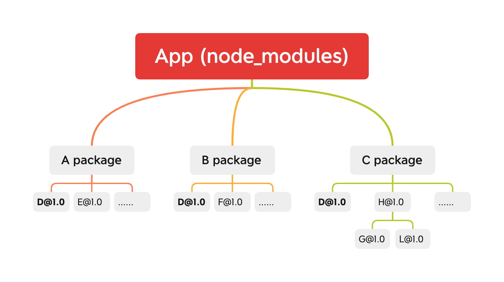

# pnpm


## 背景
如果你从事过前端方面的工作和开发，相信你对 `npm` 和 `yarn` 这样的工具已经再熟悉不过了。作为包管理工具，`npm` 已经有了长足的[历史](https://github.com/npm/cli/blob/latest/changelogs/CHANGELOG-1.md)。一个项目初始化过程都需要通过 `npm install` 命令安装相关的依赖到 `node_modules` 目录下,对于较大型的前端项目，`node_modules` 的大小很多时候是超乎我们想象的。而 `npm` 在版本更新迭代的过程中，也一直在优化这个问题，下面我们就简要聊聊 `npm` 的发展历程。

## npm 发展

### npm2 

在 `npm2` 发展阶段，安装依赖是相对比较直接的，它会直接按照配置文件 `package.json` 中的依赖项去下载相关依赖包，而依赖包的组织形式则是按照树形结构去排列的。由于不同的包的依赖关系在版本上差异较大，依赖关系相对复杂，所以 `npm2` 直接按照配置去下载并组织依赖的方式，是简单明晰的做法，保证了各个依赖的独立性，在依赖变更时，相互并不影响，其关系可以通过下图来描述：



从上图中，我们可以看到
1. `A`、`B`、`C` 包相互独立
2. `A`、`B`、`C` 包可能会依赖相同的包，比如 **`D@1.0`**
3. `A`、`B`、`C` 包可能会存在较深的依赖层级，比如 **`C package`**

其中 `2` 和 `3` 这两点的负面影响会随着项目复杂度而上升，可能会导致的几个问题
- 较大的冗余。多次下载的相同的依赖包 **`D@1.0`**，无法实现共享
- 较深层级的依赖树。
  - `node_modules` 依赖包路径过长，超出操作系统最长路径限制（ `windows`：`260` 字符，`macos`：`1024` 字符），参见：
    - [Too many dependencies break the Windows file system](https://github.com/npm/npm/issues/3697) 
    - [Maximum Path Length Limitation](https://docs.microsoft.com/en-us/windows/win32/fileio/maximum-file-path-limitation?tabs=cmd)
    - [Why does the 260 character path length limit exist in Windows?](https://stackoverflow.com/questions/1880321/why-does-the-260-character-path-length-limit-exist-in-windows)
  - 太深的层级导致文件查找复杂度上升，严重影响性能，增加耗时 

> Note: 通过 `npm ls --depth=n` 查看项目相关依赖层级深度

### npm3
为解决 `npm2` 中存在的冗余和依赖树问题，`npm3` 对依赖项进行了[依赖扁平化讨论和处理](https://github.com/npm/cli/blob/latest/changelogs/CHANGELOG-3.md)


扁平化具体来讲就是依赖不在按照树型进行安装，而是安装将依赖安装在同级目录下，`npm install` 安装依赖时，会按照配置文件 `package.json` 里的依赖顺序进行解析，遇到新包就把它放在第一层级的目录（如 **`D@1.0`、`E@1.0`、`F@1.0`**），后面如果遇到第一级目录已有的包，会先进行依赖版本判断，如果版本一样则忽略，否则会按照 `npm2` 的方式依次挂在依赖包目录下,这样处理的原理遵循了[`Nodejs`的依赖解析规则](https://nodejs.org/api/modules.html#all-together)：**当前目录下没有找到`node_modules`，它将递归解析父目录下的`node_modules`**。

使用 `npm3` 安装依赖后如下图：


这种扁平化处理方式一定程度上缓解了冗余和依赖树问题，同时 `npm3` 还支持动态安装更新包，如果依赖有更新，可以通过 `npm dedupe` 命令对依赖树进行优化。

但是 `npm3` 也存在部分问题，比如：

- [phantom_deps(幻影依赖)](https://rushjs.io/pages/advanced/phantom_deps/)。**`npm3`不会以确定的方式安装依赖项**。举例来说：我们在 `NodeJS` 中 `require()` 的函数，不需要考虑配置文件 `package.json` 中是否有该依赖项。这可能会导致依赖版本不兼容，并且开发者不容易发现；另外，由于[`Nodejs`的依赖解析规则](https://nodejs.org/api/modules.html#all-together)，这还会导致幻影 `node_modules` ，即依赖向上查找，可能会越过代码目录自身的 `node_modules` 。如下：

```json
- my-monorepo/
  - package.json
  - node_modules/
    - semver/
    - ...
  - my-monorepo/my-library/
    - package.json
    - lib/
      - index.js
    - node_modules/
      - brace-expansion
      - minimatch
      - ...
```
`my-monorepo/my-library/lib/index.js` 可能使用的是`my-monorepo/node_modules` 中的依赖，而非自身目录 `my-monorepo/my-library/node_modules`

- [npm doppelgangers(npm 分身)](https://rushjs.io/pages/advanced/npm_doppelgangers/)。简单来讲，npm 分身是指同一个依赖的不同版本会出现在 `node_modules` 中，比如项目中同时依赖了 `A@1.0.0` 和 `A@2.0.0`，无论是扁平化处理`A@1.0.0` 或 `A@2.0.0`，另一个依赖还是会被重复，如果这样的分身较多，就会导致一些潜在问题，比如扩展包大小变大、相关类型校验交叉等

### npm5
npm5 通过添加 `lock` 文件来记录依赖树信息，进行依赖锁定,从而唯一确定 `node_modules` 的结构,这样处理可以保证团队成员使用同一份`node_modules`依赖结构。但是，我们前文提到的平铺式的算法的复杂性、幻影依赖和分身问题仍然没有解决。

## pnpm 简介
前文我们大致梳理了 `npm` 的发展和遗留问题。而 `pnpm` 比较巧妙地解决了它们，并且极大地提升了依赖包管理的效率。

`pnpm` 指 `performant npm`（高性能的 npm），如 [pnpm 官网](https://pnpm.io/)所言，它是**快速的，节省磁盘空间的包管理工具**，同时，它也较好地支持了 `workspace` 和 `monorepos`。


举例来说，如果项目中，你使用了某个依赖项的多个版本，那么 `pnpm` 只会将有差异的文件添加到仓库。如果某个依赖包有 100 个文件，而它的新版本只改变了其中 1 个文件。那么 `pnpm update` 时只会添加 1 个新文件，而不会复制整个新版本的所有包。此外。所有文件都会存储在硬盘上的某一位置。 当依赖包被被安装时，其中的文件会硬链接到这一位置，而不会占用额外的磁盘空间。同时，项目中允许共享同一版本的依赖。接下来我们先了解下 `pnpm` 的使用效果

## pnpm 效果
> 与 npm、yarn、yarn pnp 工具链效果对比，来自 [pnpm benchmarks](https://pnpm.io/zh/benchmarks)

<table><thead>
<tr><th>action</th><th>cache</th><th>lockfile</th><th>node_modules</th><th>npm</th><th>pnpm</th><th>Yarn</th><th>Yarn PnP</th></tr></thead><tbody><tr><td>install</td><td></td><td></td><td></td><td>1m 9.5s</td><td>15.3s</td><td>16.6s</td><td>23.6s</td></tr><tr><td>install</td><td>✔</td><td>✔</td><td>✔</td><td>2.4s</td><td>1.3s</td><td>2.3s</td><td>n/a</td></tr><tr><td>install</td><td>✔</td><td>✔</td><td></td><td>14.8s</td><td>4s</td><td>6.8s</td><td>1.5s</td></tr><tr><td>install</td><td>✔</td><td></td><td></td><td>21.8s</td><td>8.9s</td><td>11.2s</td><td>6.2s</td></tr><tr><td>install</td><td></td><td>✔</td><td></td><td>35.4s</td><td>13.4s</td><td>12s</td><td>17.9s</td></tr><tr><td>install</td><td>✔</td><td></td><td>✔</td><td>3.1s</td><td>1.9s</td><td>7s</td><td>n/a</td></tr><tr><td>install</td><td></td><td>✔</td><td>✔</td><td>2.4s</td><td>1.3s</td><td>7.6s</td><td>n/a</td></tr><tr><td>install</td><td></td><td></td><td>✔</td><td>3s</td><td>6.1s</td><td>11.8s</td><td>n/a</td></tr><tr><td>update</td><td>n/a</td><td>n/a</td><td>n/a</td><td>2.3s</td><td>11.8s</td><td>15.5s</td><td>28.3s</td></tr>
</tbody></table>

从上表数据我们可以看出，`pnpm` 的各项性能均比其它包管理工具有优势，那你可能会想，为什么 `pnpm` 有如此优越的表现🤔，接下来我们聊聊 `pnpm` 的主要原理

## pnpm 的原理

`pnpm` 主要有两个不同与其包管理工具的特性：

### 基于硬链接的 `node_modules`
`pnpm` 创建从全局存储到项目中 `node_modules` 文件夹的[硬链接](https://zh.wikipedia.org/wiki/%E7%A1%AC%E9%93%BE%E6%8E%A5)，而硬链接指向磁盘上原始文件所在的同一位置，具体来说就是 `node_modules` 中每个包的每个文件都是来自[内容可寻址存储](https://en.wikipedia.org/wiki/Content-addressable_storage)的硬链接，简言之，就是特定版本和名称的包全局只有一份。举例来看：

```file
node_modules
└── .pnpm
    ├── bar@1.0.0
    │   └── node_modules
    │       └── bar -> <store>/bar
    │           ├── index.js
    │           └── package.json
    └── foo@1.0.0
        └── node_modules
            └── foo -> <store>/foo
                ├── index.js
                └── package.json
```
`node_modules` 下面的唯一文件夹叫做 `.pnpm`, `.pnpm` 下面是一个 `<PACKAGE_NAME＠VERSION>` 文件夹，而在其下面 `<PACKAGE_NAME>` 的文件夹是一个基于内容可寻址存储的硬链接。同时，我们也可以通过 `pnpm root` 命令来打印当前项目中存放模块（modules）的有效目录

### 基于依赖解析的软链接 symlinks
观察以下依赖包结构
```file
node_modules
├── foo -> ./.pnpm/foo@1.0.0/node_modules/foo
└── .pnpm
    ├── bar@1.0.0
    │   └── node_modules
    │       └── bar -> <store>/bar
    └── foo@1.0.0
        └── node_modules
            ├── foo -> <store>/foo
            └── bar -> ../../bar@1.0.0/node_modules/bar
```

我们可以看到在 `foo@1.0.0/node_modules/bar` 内引用了 `bar` 的软链接 `../../bar@1.0.0/node_modules/bar`，而在项目里引用 `foo` 的软链接 `./.pnpm/foo@1.0.0/node_modules/foo`，如果项目内新增一个依赖包 `qar@2.0.0`，则其引用结构如下：

```file
node_modules
├── foo -> ./.pnpm/foo@1.0.0/node_modules/foo
└── .pnpm
    ├── bar@1.0.0
    │   └── node_modules
    │       ├── bar -> <store>/bar
    │       └── qar -> ../../qar@2.0.0/node_modules/qar
    ├── foo@1.0.0
    │   └── node_modules
    │       ├── foo -> <store>/foo
    │       ├── bar -> ../../bar@1.0.0/node_modules/bar
    │       └── qar -> ../../qar@2.0.0/node_modules/qar
    └── qar@2.0.0
        └── node_modules
            └── qar -> <store>/qar
```
根据前文我们介绍到的[`Nodejs`的依赖解析规则](https://nodejs.org/api/modules.html#all-together)，`foo@1.0.0/node_modules/foo/index.js` 中所需的依赖包 `bar`，实际上使用的是`bar@1.0.0/node_modules/bar`中的内容，因此，只有**真正在依赖项中的包才能被访问到**。而对于不同的 `peer dependencies` 的依赖解析原理，可以参考这里 [How peers are resolved](https://pnpm.io/zh/how-peers-are-resolved)

通过**基于硬链接的`node_modules`**和**基于依赖解析的软链接**原理，我们了解到，当我们在相同操作系统下第二次安装同一个依赖包时，我们需要做的仅仅是创建一个该依赖包对应的硬链接，对于同一个依赖包的不同版本，也只有不同的部分会被重新保存起来，而具体有没有 `pnpm` 是在哪里判断的呢？全局的 `pnpm` 索引文件在 `～/.pnpm-store/v3/files`。基于此，使用硬链接让依赖包的安装速度非常快，同时也去除了冗余，节省较大磁盘空间。

> [symlinks 符号连接](https://zh.wikipedia.org/wiki/%E7%AC%A6%E5%8F%B7%E9%93%BE%E6%8E%A5)

## pnpm 使用
pnpm 的具体使用这里我们不展开介绍了，可以查看官网[使用方法](https://pnpm.io/zh/pnpm-cli)和[CLI 命令](https://pnpm.io/zh/cli/add)即可。这里只提几个有意思的点

### CI 集成
在 `GitHub Actions` 上，你可以像这样使用 `pnpm` 安装和缓存依赖项，配置文件目录： `.github/workflows/NAME.yml`

```yml
name: pnpm Example Workflow
on:
  push:
jobs:
  build:
    runs-on: ubuntu-20.04
    strategy:
      matrix:
        node-version: [15]
    steps:
    - uses: actions/checkout@v2
    - uses: pnpm/action-setup@v2.0.1
      with:
        version: 6.20.3
    - name: Use Node.js ${{ matrix.node-version }}
      uses: actions/setup-node@v2
      with:
        node-version: ${{ matrix.node-version }}
        cache: 'pnpm'
    - name: Install dependencies
      run: pnpm install
```
`pnpm` 除了在开发体验方面的优越表现，在项目集成方面也毫不逊色，对于较大型项目从 `npm 或 yarn`到`pnpm`迁移过程后，也得到了极大的优化，结果如下：
<table>
<thead>
<tr>
<th align="none"></th>
<th align="none">Without cache</th>
<th align="none">With cache</th>
</tr>
</thead>
<tbody>
<tr>
<td align="none">yarn 2 (without dedupe)</td>
<td align="none">6min 31s</td>
<td align="none">1min 11s</td>
</tr>
<tr>
<td align="none">yarn 3 (without dedupe)</td>
<td align="none">4min 50s</td>
<td align="none">57s</td>
</tr>
<tr>
<td align="none">yarn 3</td>
<td align="none">4min 1s</td>
<td align="none">50s</td>
</tr>
<tr>
<td align="none">yarn 3 (optimized)</td>
<td align="none">1min 10</td>
<td align="none">45s</td>
</tr>
<tr>
<td align="none">pnpm</td>
<td align="none">58s</td>
<td align="none">24s</td>
</tr>
</tbody>
</table>

通过以上数据，我们可以 `pnpm` 在 CI 应用中的良好表现。
> 具体可以参考这篇最佳实践 [A story of how we migrated to pnpm](https://divriots.com/blog/switching-to-pnpm)

### pnpm 前置

项目中使用 `pnpm` 时，如果你不希望项目内其他人使用 `npm i` 或 `yarn`这类包管理器，可以在 `package.json` 配置文件中添加预安装 `preinstall` 配置项，从而规范使用统一的包管理器。
 
```json
{
    "scripts": {
        "preinstall": "npx only-allow pnpm"
    }
}
```

### 管理 NodeJS 版本
在以前，如果你同时支撑了多个项目，而且需要在其中切换中，你可能需要切换不同的 `NodeJS` 版本，也许你会用到像 `nvm` 或 [Volta](https://volta.sh/) 这样的 `NodeJS` 版本管理器，而 `pnpm` 从 `v6.12.0` 版本后支持了 [pnpm env](https://pnpm.io/zh/cli/env) 命令，你可以使用它来安装并指定使用哪个版本的 `NodeJS` ，是不是方便了很多。

### monorepo 支持
因为`pnpm` 对 `monorepos` 的大力支持，像 `Vue`、`Vite` 这些开源项目也转而使用了它。使用`pnpm run` 结合 `--filter` 、 `--recursive` 和 `--parallel` 选项，可以指定特定包，并高速执行相关命令。这样做的好处是之前要另外安装 `lerna` 这种 `monorepo` 管理工具的场景，现在 `pnpm` 可以包揽了。详细文章可以参考这里 [pnpm vs Lerna: filtering in a multi-package repository](https://medium.com/pnpm/pnpm-vs-lerna-filtering-in-a-multi-package-repository-1f68bc644d6a)

## 总结
本文从 `pnpm` 的出现背景开始，简要介绍了 `npm` 的发展过程及存在的问题，继而对 `pnpm` 及其效果进行了简介，重点讲述了 `pnpm` 的实现原理，并从应用侧选择了四个点展开。`pnpm` 作为新一代包管理器，自身有不少优越的表现，它通过硬链接和软链接的方式，解决了 `npm` 幻影依赖和分身问题，并且较好地解决了依赖包复用问题，从而实现了依赖包高效快速的安装，需要特别注意的是 `pnpm` 严格遵循了 `Nodejs` 依赖解析规则，规避了之前任意依赖包的访问修改问题。

当然，`pnpm` 使用过程中也存在一些问题，包括 `Vue` 官方在迁移过程中，也处理过部分问题。另外，一些包也存在兼容性问题，由于包自己实现了模块解析，并没有遵循相关规范。但 `pnpm` 也提供了相关解决方法。具体参考 [pnpm FAQ](https://pnpm.io/faq#pnpm-does-not-work-with-your-project-here)

综上，`pnpm` 是一个功能全面，性能优越的包管理器，快来体验 `pnpm` 吧。

## 参考资料
- [npm 存在的问题以及 pnpm 是怎么处理的](https://www.yuexunjiang.me/blog/problems-with-npm-and-how-pnpm-handles-them/)
- [npm/yarn 的设计缺陷，以及 pnpm 是如何改进的](https://xingyahao.com/c/pnpm-npm-yarn.html)