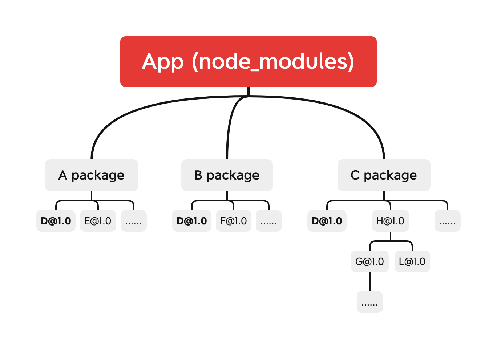

# pnpm


## 背景
如果你从从事过前端方面的工作和开发，相信你对 `npm` 和 `yarn` 这样的工具并不陌生。作为包管理工具，`npm` 已经有了长足的[历史](https://github.com/npm/cli/blob/latest/changelogs/CHANGELOG-1.md)。一个项目初始化过程都需要通过 `npm install` 命令安装相关相关的依赖到 `node_modules` 目录下,对于较大型的前端项目，`node_modules` 的大小很多时候是超乎我们想象的。而 `npm` 在版本更新迭代的过程中，也一直在优化这个问题，从 `npm3` 开始，通过平铺 `node_modules` 依赖，一定程度上缓解了重复包的复用问题。

### npm 发展

#### npm2 

在 `npm2` 发展阶段，安装依赖是相对比较直接的，它会直接按照配置文件 `package.json` 中的依赖项去下载相关依赖包，而依赖包的组织形式则是按照树形结构去排列的。由于不同的包的依赖关系在版本上差异较大，依赖关系相对复杂，所以 `npm2` 直接按照配置去下载并组织依赖的方式，是简单明晰的做法，保证了各个依赖的独立性，在依赖变更时，相互并不影响，其关系可以通过下图来描述：



从上图中，我们可以看到
- `A`、`B`、`C` 包相互独立
- `A`、`B`、`C` 包可能会依赖相同的包，比如 **`D@1.0`**
- `A`、`B`、`C` 包可能会存在较深的依赖层级，比如 **`C package`**
- 

`npm ls --depth=0`


> [npm2 npm3 yarn 的故事](https://int64ago.org/2016/10/15/npm2-npm3-yarn-%E7%9A%84%E6%95%85%E4%BA%8B/)

### 幻影依赖

https://rushjs.io/pages/advanced/phantom_deps/
### NPM 分身
https://rushjs.io/pages/advanced/npm_doppelgangers/


`pnpm` 指 `performant`（高性能的） npm，如其所言 `Fast, disk space efficient package manager`


## pnpm 解决了什么问题
> 节约磁盘空间并提升安装速度

- 如果你用到了某依赖项的不同版本，那么只会将有差异的文件添加到仓库。 例如，如果某个包有 100 个文件，而它的新版本只改变了其中 1 个文件。那么 pnpm update 时只会向存储中心额外添加 1 个新文件，而不会因为仅仅一个文件的改变复制整新版本包的内容。

- 所有文件都会存储在硬盘上的某一位置。 当软件包被被安装时，包里的文件会硬链接到这一位置，而不会占用额外的磁盘空间。 这允许你跨项目地共享同一版本的依赖。


## pnpm 使用方法

#### ci 持续集成
在 GitHub Actions 上，您可以像这样使用 pnpm 安装和缓存您的依赖项 .github/workflows/NAME.yml）
```yml
name: pnpm Example Workflow
on:
  push:
jobs:
  build:
    runs-on: ubuntu-20.04
    strategy:
      matrix:
        node-version: [15]
    steps:
    - uses: actions/checkout@v2
    - uses: pnpm/action-setup@v2.0.1
      with:
        version: 6.20.3
    - name: Use Node.js ${{ matrix.node-version }}
      uses: actions/setup-node@v2
      with:
        node-version: ${{ matrix.node-version }}
        cache: 'pnpm'
    - name: Install dependencies
      run: pnpm install
```

#### 只允许 pnpm
当您在项目中使用 pnpm 时，您不希望被其他人意外运行 npm install 或 yarn。 为了防止开发人员使用其他的包管理器，您可以将下面的这个 preinstall 脚本添加到您的 package.json：

```json
{
    "scripts": {
        "preinstall": "npx only-allow pnpm"
    }
}
```
## pnpm 的原理
[symlinks 符号连接](https://zh.wikipedia.org/wiki/%E7%AC%A6%E5%8F%B7%E9%93%BE%E6%8E%A5)

## pnpm、npm yarn 工具链效果对比

### 时间
https://pnpm.io/zh/benchmarks

#### 官方
<table><thead>
<tr><th>action</th><th>cache</th><th>lockfile</th><th>node_modules</th><th>npm</th><th>pnpm</th><th>Yarn</th><th>Yarn PnP</th></tr></thead><tbody><tr><td>install</td><td></td><td></td><td></td><td>1m 9.5s</td><td>15.3s</td><td>16.6s</td><td>23.6s</td></tr><tr><td>install</td><td>✔</td><td>✔</td><td>✔</td><td>2.4s</td><td>1.3s</td><td>2.3s</td><td>n/a</td></tr><tr><td>install</td><td>✔</td><td>✔</td><td></td><td>14.8s</td><td>4s</td><td>6.8s</td><td>1.5s</td></tr><tr><td>install</td><td>✔</td><td></td><td></td><td>21.8s</td><td>8.9s</td><td>11.2s</td><td>6.2s</td></tr><tr><td>install</td><td></td><td>✔</td><td></td><td>35.4s</td><td>13.4s</td><td>12s</td><td>17.9s</td></tr><tr><td>install</td><td>✔</td><td></td><td>✔</td><td>3.1s</td><td>1.9s</td><td>7s</td><td>n/a</td></tr><tr><td>install</td><td></td><td>✔</td><td>✔</td><td>2.4s</td><td>1.3s</td><td>7.6s</td><td>n/a</td></tr><tr><td>install</td><td></td><td></td><td>✔</td><td>3s</td><td>6.1s</td><td>11.8s</td><td>n/a</td></tr><tr><td>update</td><td>n/a</td><td>n/a</td><td>n/a</td><td>2.3s</td><td>11.8s</td><td>15.5s</td><td>28.3s</td></tr>
</tbody></table>

#### ci 提速
[我们如何迁移到 pnpm 的故事](https://divriots.com/blog/switching-to-pnpm)

### 功能
https://pnpm.io/zh/feature-comparison

## pnpm 的局限

## 参考资料

https://pnpm.io/zh/community
https://pnpm.io/zh/blog