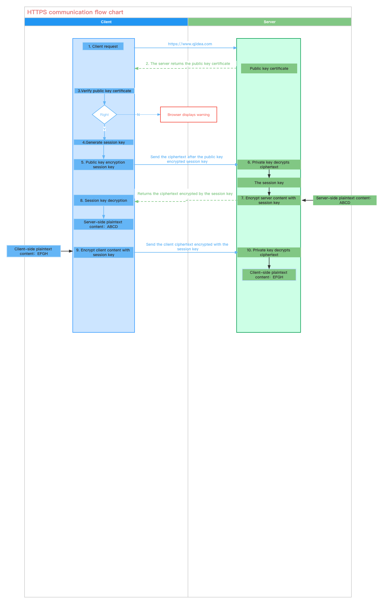

# Finpoints Assessment

## Web Network and Security
- Why is HTTPS more secure than HTTP?
> - HTTPS is based on SSL or TLS, which is encrypted secure communication, which cannot be obtained through the captain tool to obtain information, even if someone gets information, can not decrypt.
> - Use the CA digital signing certificate to prevent intermediary attacks.
> - HTTPS standard port 443, HTTP standard port 80. At the same time, it helps SEO and is more friendly to search engines.



- What are the differences between RPC and HTTP?
> - PRC：Remote Produce Call. When using the RPC framework to implement inter-service calls, both the service provider and the service consumer must use a unified RPC framework, either dubbo or cxf, which can be used across operating systems in the same programming language, with the advantage of calling Fast, fast processing.at the same time,RPC calls are service-oriented encapsulation, optimized for service availability and efficiency.
> - HTTP: HyperText Transfer Protocol. When using http to make inter-service calls, there is no need to pay attention to the programming language used by the service provider, nor the programming language used by the service consumer. The service provider only needs to provide a restful-style interface, and the service consumer follows the restful principle. request service
A framework for remote invocation across systems and programming languages. Its advantage is that it is versatile

- Have you used any packet capture tools before? How to avoid information leakage when the packet is captured?
> - I have used wireshark, a packet capture tool, to view http and TCP packets. For HTTPS, only binary is displayed, rendered in ciphertext
> - Using HTTPS, the token, RC or DES algorithm used in the symmetric encryption communication process.

- Develop a Socket communication model (client and server) by using the programming language that you are
familiar with

> - socket io chat examples with server and client,https://socket.io/get-started/private-messaging-part-1/


## Web Performance Optimization

- What tools will be used for the web frontend performance monitoring testing?
> - chrome Lighthouse
> - others,https://performancelabus.com/front-end-performance-testing/


- What are the ways to optimise the transmission between web frontend and backend?
> - https://developpaper.com/how-to-optimize-the-performance-of-web-front-end/
> - https://developpaper.com/web-front-end-performance-optimization/
> - gzip

## Coding

- How to implement the correspondence between multiple tabs within the browser? Please provide a demo. 
  
    ```ts
    实现浏览器 TAB 之间的通信功能
    https://blog.bitsrc.io/4-ways-to-communicate-across-browser-tabs-in-realtime-e4f5f6cbedca

    https://www.google.com/search?q=%E5%A6%82%E4%BD%95%E5%AE%9E%E7%8E%B0%E6%B5%8F%E8%A7%88%E5%99%A8%E5%86%85%E5%A4%9A%E4%B8%AA%E6%A0%87%E7%AD%BE%E7%9A%84%E9%80%9A%E4%BF%A1&newwindow=1&sxsrf=APq-WBuaehmucj0WPynX7mkll2mynteH3A%3A1649929430397&source=hp&ei=1uxXYof6FeubmAWb_qTABg&iflsig=AHkkrS4AAAAAYlf65otVY50GZcea-bZI8dcMQ5UjE2QM&ved=0ahUKEwiHveeMopP3AhXrDaYKHRs_CWgQ4dUDCAk&uact=5&oq=%E5%A6%82%E4%BD%95%E5%AE%9E%E7%8E%B0%E6%B5%8F%E8%A7%88%E5%99%A8%E5%86%85%E5%A4%9A%E4%B8%AA%E6%A0%87%E7%AD%BE%E7%9A%84%E9%80%9A%E4%BF%A1&gs_lcp=Cgdnd3Mtd2l6EANQAFjlKWC5K2gBcAB4AYABzASIAcsRkgEKMC4xMC4xLjUtMZgBAKABAqABAQ&sclient=gws-wiz
    ts
    ```
- Implement an exchange sort algorithm by using any programming language that you are familiar with.
    ```ts
    ts
    https://magiclen.org/sorting-algorithm/
    ```