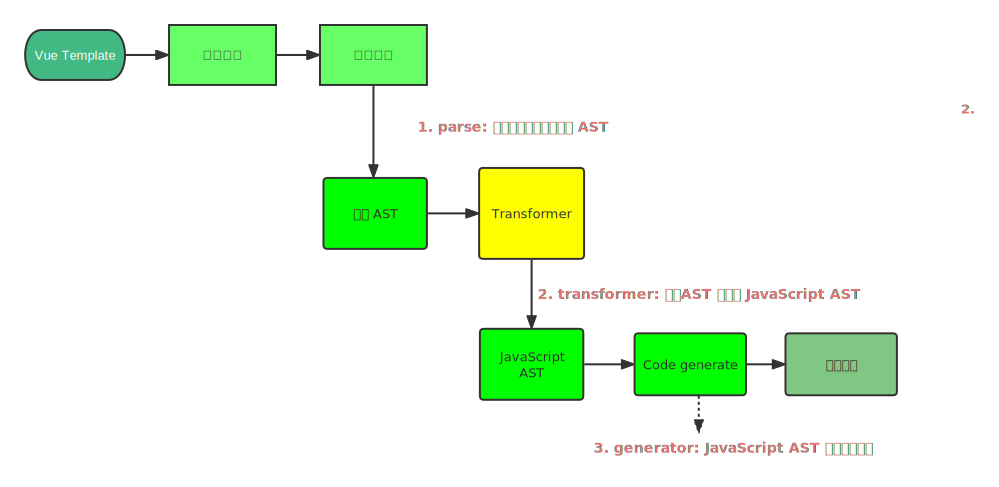

# 编译器

## 编译器主流程

`Vue` 模板编译主要过程
- 将模板字符串编译为模板 `AST`
- 将模板 `AST` 编译为 `JavaScript AST`
- 根据 `JavaScript AST` 生成渲染函数



伪代码实现

```ts
const templateAST = parse(template)
const jsAST = transform(templateAST)
const code = generate(jsAST)
```

### `parse` 编译


```ts
const templateAST = parse(template)

// parse html
const State = {
    init: 1,
    tageOpen: 2,
    tagName: 3,
    text: 4,
    tagEnd: 5,
    tagEndName: 6
}

function isAlpha(char: string) {
    return char >= 'a' && char <= 'z' || char >= 'A' && char <= 'Z'
}

export function tokenie(str: string) {
    let currentState = State.init

    const chars = []
    const tokens = []

    while (str) {
        const char = str[0]

        switch (currentState) {
            case State.init:
                if (char === '<') {
                    currentState = State.tageOpen
                    str = str.slice(1)
                } else if (isAlpha(char)) {
                    currentState = State.text

                    chars.push(char)
                    str = str.slice(1)
                }

                break
            case State.tageOpen:
                if (isAlpha(char)) {
                    currentState = State.tagName

                    chars.push(char)
                    str = str.slice(1)
                } else if (char === '/') {
                    currentState = State.tagEnd
                    str = str.slice(1)
                }


                break
            case State.tagName:
                if (isAlpha(char)) {
                    chars.push(char)
                    str = str.slice(1)
                } else if (char === '>') {
                    currentState = State.init

                    tokens.push({
                        type: 'tag',
                        name: chars.join('')
                    })

                    chars.length = 0

                    str = str.slice(1)
                }

                break

            case State.text:
                if (isAlpha(char)) {
                    chars.push(char)

                    str = str.slice(1)
                } else if (char === '<') {
                    currentState = State.tageOpen

                    tokens.push({
                        tag: 'text',
                        content: chars.join('')
                    })

                    chars.length = 0
                    str = str.slice(1)
                }
                break
            case State.tagEnd:
                if (isAlpha(char)) {
                    currentState = State.tagEndName
                    chars.push(char)
                    str = str.slice(1)
                }

                break

            case State.tagEndName:
                if (isAlpha(char)) {
                    chars.push(char)

                    str = str.slice(1)
                } else if (char === '>') {
                    currentState = State.init

                    tokens.push({
                        type: 'tagEnd',
                        name: chars.join('')
                    })

                    chars.length = 0

                    str = str.slice(1)
                }

                break
        }
    }

    return tokens
}
```