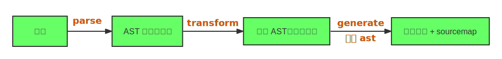
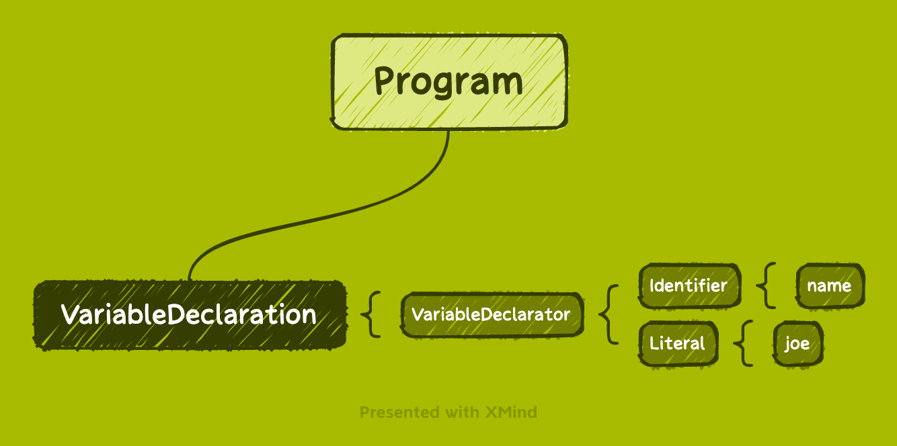

# Babel
`Babel` 是一个 `JavaScript` 编译器。`Babel` 不做类型检查，你仍然需要安装 `Flow` 或 `TypeScript` 来执行类型检查的工作。

## 用途
- 转译 `esnext`、`typescript`、`flow` 等到目标环境支持的 `js`
- 代码转换，比如：函数插桩、自动国际化
- 代码静态分析：linter、API 文档、类型检查、压缩混淆、js 解释器

## 编译流程
`Babel` 编译流程如下，主要包含三个步骤


- `parse`: 把源码转成抽象语法树 `AST`
- `transform`: 遍历 `AST`，调用各种 `transform` 插件对 `AST` 进行增删改
- `generate`: 将转换后的 `AST` 打印生成代码，同时生成对应的 `Sourcemap`
### parse
源码字符串转换成机器能够理解的 `AST`，该过程分为词法分析、语法分析

以 `let name = 'joe'` 为例，经过 `parse` 后，它的 `AST` (基于 [acorn](https://github.com/acornjs/acorn))结构如下：
```json
{
  "type": "Program",
  "start": 0,
  "end": 16,
  "body": [
    {
      "type": "VariableDeclaration",
      "start": 0,
      "end": 16,
      "declarations": [
        {
          "type": "VariableDeclarator",
          "start": 4,
          "end": 16,
          "id": {
            "type": "Identifier",
            "start": 4,
            "end": 8,
            "name": "name"
          },
          "init": {
            "type": "Literal",
            "start": 11,
            "end": 16,
            "value": "joe",
            "raw": "'joe'"
          }
        }
      ],
      "kind": "let"
    }
  ],
  "sourceType": "module"
}
```
从以上 `AST` 可以看出，其类型结构如下图：



> [AST 生成站点](https://astexplorer.net/)

### transform

`transform` 阶段是基于 `parse` 结果的操作，通过 `AST` 遍历，遍历过程中调用注册的相应的 `visitor` 函数，`visitor` 函数里可以对 AST 节点进行增删改，返回新的 `AST`
TODO: image && source 

### generate

`generate` 阶段会把 `AST` 打印成目标代码字符串，并且会生成 `sourcemap`。

`sourcemap` 记录了源码到目标代码的转换关系，通过它我们可以找到目标代码中每一个节点对应的源码位置。

## AST 节点类型
`AST` 是对源码的抽象，字面量、标识符、表达式、语句、模块语法、`class` 语法都有各自的 `AST`

### Literal
